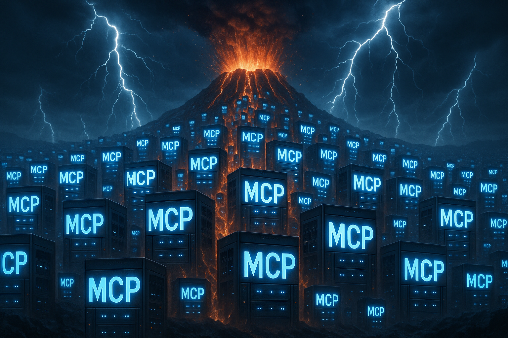
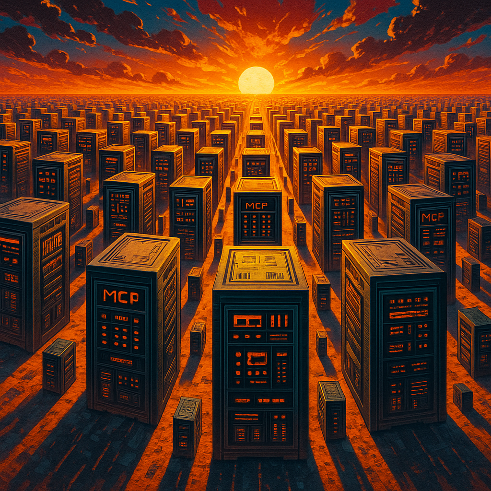
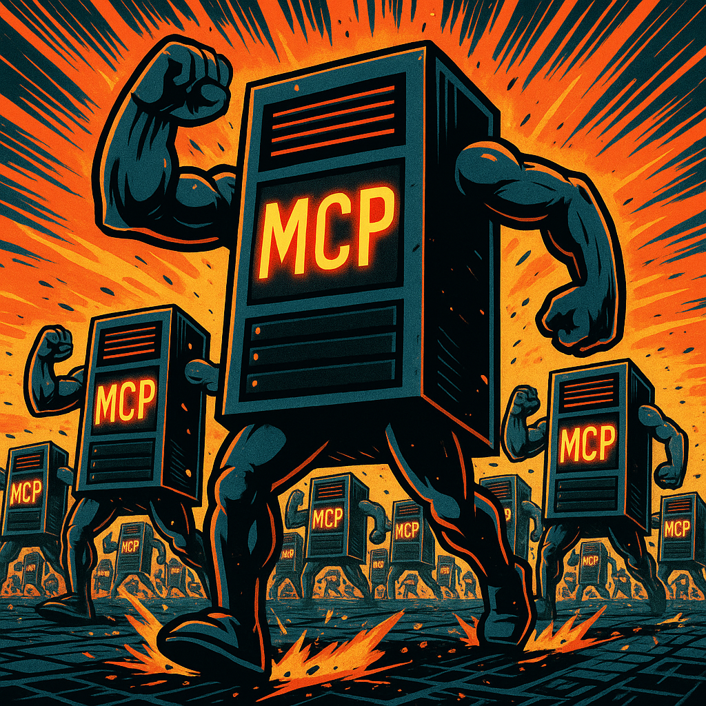
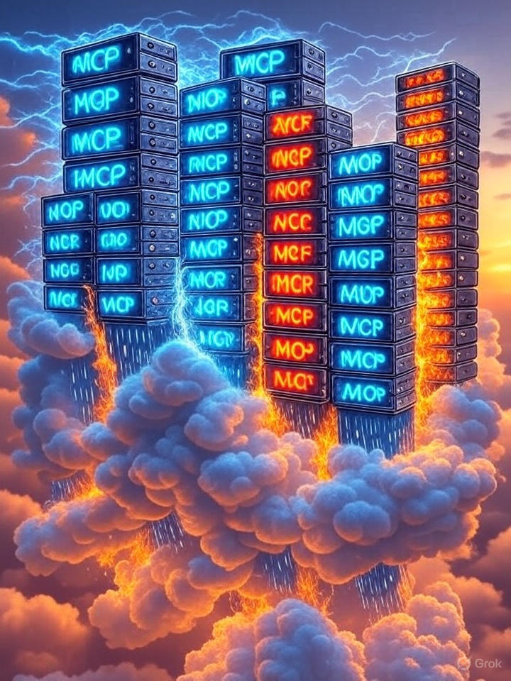
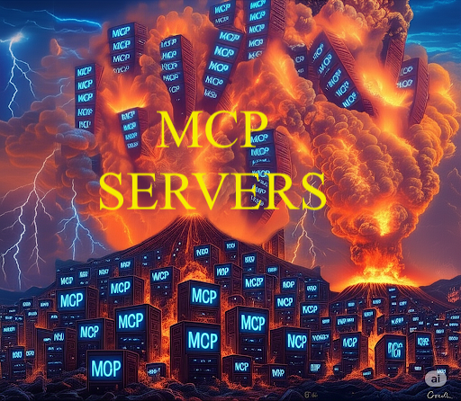

How the images are generated. 

Initial prompt:
I want to create a image drawing prompt. I want to draw an image showing that there is an increased number of MCP servers. There is a lot of them. Help me determine different prompts I can use to show the vast number of MCP. I want it to be illustrative, eye-grabbing and very click-bait.

## Grok
### prompts
### Dramatic Explosion of Servers
"A hyper-realistic digital illustration of an explosive growth in MCP servers: thousands of glowing blue server racks erupting from a massive volcano like lava, filling the entire landscape under a stormy sky, with lightning bolts highlighting the sheer overwhelming number, in a cinematic style that's shocking and attention-grabbing, ultra-detailed, 4K resolution."

### Infinite Server Horizon
"An eye-popping surreal landscape where the horizon is an endless sea of MCP servers stretching infinitely into the distance, like a futuristic city multiplied a million times, with dramatic golden hour lighting casting long shadows to emphasize the vast scale, highly illustrative and clickbait-worthy, vibrant colors, high contrast."

### Server Army Invasion
"Illustrate a massive invasion of MCP servers as an unstoppable army marching across a digital battlefield, rows upon rows of anthropomorphic server towers with glowing eyes, overwhelming the foreground in epic proportions, in a bold comic-book style that's super engaging and viral, explosive action pose, neon accents for maximum clickbait appeal."

### Growth Chart Rocket
"A vibrant, exaggerated infographic-style image of a skyrocketing graph labeled 'MCP Servers Explosion' with bars bursting through the clouds, each bar morphing into clusters of hundreds of shiny server icons raining down like meteors, eye-grabbing colors like fiery red and electric blue, illustrative with cartoonish flair to scream massive increase."

### Factory Overload
"Create a chaotic, illustrative scene of a gigantic factory spewing out endless streams of MCP servers like a waterfall, piling up into mountains that dwarf tiny human figures below, with steam, sparks, and glowing lights for dramatic effect, in a steampunk-futuristic hybrid style that's incredibly clickbait-y and attention-demanding, ultra-wide angle."
- No good image generated

## Final Merged image: 

